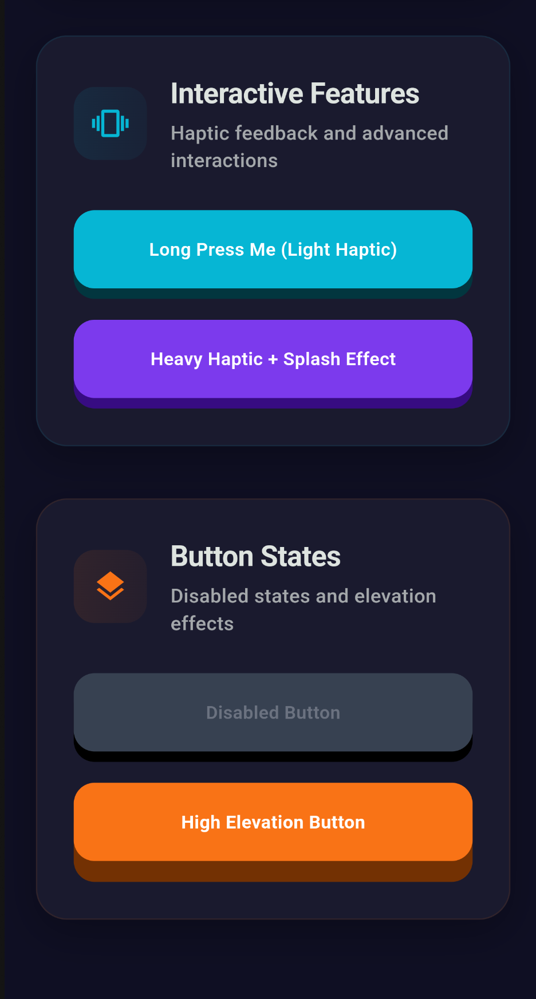

# Bouncy Button

A highly customizable Flutter button widget with engaging 3D depth effects, smooth animations, and extensive styling options. Create beautiful, interactive buttons that respond to user input with satisfying visual feedback.

## Features

✨ **3D Depth Effect** - Realistic button press with customizable elevation  
🎨 **Extensive Styling** - Gradients, shadows, borders, and custom decorations  
🎭 **Multiple Animations** - Depth, scale, rotation, bounce, fade, and slide effects  
📱 **Haptic Feedback** - Native platform haptic feedback support  
🎯 **Gesture Support** - Tap, long press, and drag interactions  
♿ **Accessibility** - Full semantic label and focus support  
🎨 **Theme Integration** - Seamless integration with Material Theme  
⚡ **High Performance** - Optimized animations and rendering

## Installation

Add this to your package's `pubspec.yaml` file:

```yaml
dependencies:
  bouncy_button: //updated_version
```

Then run:

```bash
flutter pub get
```

## Demo

[Link Text](https://github.com/Ibrahim-Lokman/bouncy_button?tab=readme-ov-file#demo)

<div align="center">
  
  <br><br>
  
</div>

## Screenshots

[Link Text](https://github.com/Ibrahim-Lokman/bouncy_button?tab=readme-ov-file#screenshots)

### Light Theme

 

### Dark Theme

 

## Usage

### Simple Usage

```dart
import 'package:bouncy_button/bouncy_button.dart';

BouncyButton(
  onPressed: () {
    print('Button pressed!');
  },
  child: Text('Click Me'),
)
```

### Using Predefined Styles

```dart
// Primary style button
BouncyButton.primary(
  onPressed: () {},
  child: Text('Primary Button'),
)

// Secondary style button
BouncyButton.secondary(
  onPressed: () {},
  child: Text('Secondary Button'),
)
```

### Custom Styling

```dart
BouncyButton(
  onPressed: () {},
  style: BouncyButtonStyle(
    height: 60,
    elevation: 10,
    backgroundColor: Colors.purple,
    borderRadius: BorderRadius.circular(30),
    shadowDarkness: 0.4,
  ),
  child: Text('Custom Style'),
)
```

### With Gradient

```dart
BouncyButton(
  onPressed: () {},
  style: BouncyButtonStyle(
    gradient: LinearGradient(
      colors: [Colors.blue, Colors.purple],
      begin: Alignment.topLeft,
      end: Alignment.bottomRight,
    ),
  ),
  child: Text('Gradient Button'),
)
```

### Different Animation Types

```dart
// Scale animation
BouncyButton(
  onPressed: () {},
  animation: BouncyButtonAnimation(
    type: BouncyButtonAnimationType.scale,
    scaleAmount: 0.9,
  ),
  child: Text('Scale Animation'),
)

// Bounce animation
BouncyButton(
  onPressed: () {},
  animation: BouncyButtonAnimation(
    type: BouncyButtonAnimationType.bounce,
    duration: Duration(milliseconds: 200),
  ),
  child: Text('Bounce Animation'),
)
```

### With Haptic Feedback

```dart
BouncyButton(
  onPressed: () {},
  interaction: BouncyButtonInteraction(
    enableHapticFeedback: true,
    hapticFeedbackType: HapticFeedbackType.medium,
  ),
  child: Text('Haptic Feedback'),
)
```

### Icon Button

```dart
BouncyButton(
  onPressed: () {},
  style: BouncyButtonStyle.circle.copyWith(
    backgroundColor: Colors.red,
    width: 56,
    height: 56,
  ),
  child: Icon(Icons.favorite, color: Colors.white),
)
```

### Disabled State

```dart
BouncyButton(
  onPressed: null, // or enabled: false
  style: BouncyButtonStyle(
    disabledColor: Colors.grey,
  ),
  child: Text('Disabled Button'),
)
```

## Advanced Usage

### Custom Builder

```dart
BouncyButton(
  onPressed: () {},
  builder: (context, isPressed) {
    return Container(
      padding: EdgeInsets.all(16),
      child: Row(
        mainAxisSize: MainAxisSize.min,
        children: [
          Icon(
            isPressed ? Icons.star : Icons.star_border,
            color: isPressed ? Colors.yellow : Colors.white,
          ),
          SizedBox(width: 8),
          Text('Custom Builder'),
        ],
      ),
    );
  },
  child: Container(), // Child is ignored when builder is provided
)
```

### Theme Integration

```dart
MaterialApp(
  theme: ThemeData(
    extensions: [
      BouncyButtonTheme(
        primaryStyle: BouncyButtonStyle(
          backgroundColor: Colors.blue,
          elevation: 8,
        ),
        defaultAnimation: BouncyButtonAnimation(
          duration: Duration(milliseconds: 100),
        ),
      ),
    ],
  ),
  home: MyHomePage(),
)
```

### Color Utilities

```dart
// Create gradient from single color
final gradient = BouncyButtonColors.gradientFromColor(
  Colors.blue,
  spread: 0.2,
);

// Get complementary color
final complementary = BouncyButtonColors.complementary(Colors.blue);

// Create color schemes
final analogous = BouncyButtonColors.analogous(Colors.blue);
final triadic = BouncyButtonColors.triadic(Colors.blue);
final monochromatic = BouncyButtonColors.monochromatic(Colors.blue);
```

## Customization Options

### BouncyButtonStyle Properties

| Property          | Type                    | Description                     |
| ----------------- | ----------------------- | ------------------------------- |
| `height`          | `double`                | Button height (default: 60)     |
| `width`           | `double?`               | Button width (null = auto-size) |
| `elevation`       | `double`                | 3D depth effect (default: 8)    |
| `backgroundColor` | `Color?`                | Background color                |
| `gradient`        | `Gradient?`             | Gradient background             |
| `borderRadius`    | `BorderRadiusGeometry?` | Corner radius                   |
| `shadowDarkness`  | `double`                | Shadow darkness (0.0-1.0)       |
| `padding`         | `EdgeInsetsGeometry?`   | Internal padding                |
| `border`          | `BoxBorder?`            | Border decoration               |

### BouncyButtonAnimation Properties

| Property        | Type                        | Description               |
| --------------- | --------------------------- | ------------------------- |
| `duration`      | `Duration`                  | Animation duration        |
| `curve`         | `Curve`                     | Animation curve           |
| `type`          | `BouncyButtonAnimationType` | Animation type            |
| `scaleAmount`   | `double`                    | Scale factor (0.0-1.0)    |
| `rotationAngle` | `double`                    | Rotation angle in radians |

### BouncyButtonInteraction Properties

| Property               | Type                 | Description             |
| ---------------------- | -------------------- | ----------------------- |
| `enableHapticFeedback` | `bool`               | Enable haptic feedback  |
| `hapticFeedbackType`   | `HapticFeedbackType` | Type of haptic feedback |
| `enableSplash`         | `bool`               | Enable splash effect    |
| `splashColor`          | `Color?`             | Splash color            |
| `cursor`               | `MouseCursor?`       | Mouse cursor on hover   |

## Examples

Check out the [example](example/) folder for a complete sample app demonstrating all features.

## Contributing

Contributions are welcome! Please feel free to submit a Pull Request.

1. Fork the repository
2. Create your feature branch (`git checkout -b feature/AmazingFeature`)
3. Commit your changes (`git commit -m 'Add some AmazingFeature'`)
4. Push to the branch (`git push origin feature/AmazingFeature`)
5. Open a Pull Request

## License

This project is licensed under the MIT License - see the [LICENSE](LICENSE) file for details.

## Author

**Ibrahim Lokman**

- 🌐 GitHub: [@Ibrahim-Lokman](https://github.com/Ibrahim-Lokman)
- 💼 LinkedIn: [ibrahim-lokman](https://www.linkedin.com/in/ibrahim-lokman/)
- 📧 Email: ibrahimlokman.bd@gmail.com
- 📍 Location: Bangladesh (GMT+6)

## Support

If you find this package useful, please consider:

- ⭐ Giving it a star on [GitHub](https://github.com/Ibrahim-Lokman/bouncy_button)
- 👍 Liking it on [pub.dev](https://pub.dev/packages/bouncy_button)
- 🐛 Reporting issues on the [issue tracker](https://github.com/Ibrahim-Lokman/bouncy_button/issues)

---

_Built with ❤️ in Bangladesh_
